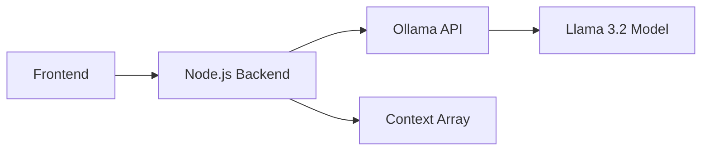

# Educational-Chatbot

A modern, responsive chat interface powered by Llama 3.2 running completely locally. Designed specifically for educational purposes, this application provides students with an interactive learning experience through conversations, quizzes, and guided learning.


## Features ✨

- **Completely Local Operation**: Everything runs locally, including the Large Language Model
  - No data sent to external servers
  - Full privacy for student interactions
  - No API costs or usage limits
  - Works offline after initial setup
  - Lower latency due to local processing

- **Modern UI/UX**:
  - Clean, intuitive chat interface
  - Dark/Light mode support
  - Responsive design for all devices
  - Real-time typing indicators
  - Markdown formatting support
  - Professional message bubbles
  - Smooth animations and transitions

- **Educational Features**:
  - Contextual learning assistance
  - Interactive quizzes and assessments
  - Subject-specific guidance
  - Progress tracking through conversation context
  - Customized learning paths

- **Technical Features**:
  - Local LLM integration via Ollama
  - Conversation context preservation
  - Backend health monitoring
  - System prompts optimized for education
  - Cross-platform compatibility

## Prerequisites 📋

- Node.js (v14 or higher)
- Ollama

## Setup Instructions 🚀

### 1. LLM Setup

1. Install Ollama:
   - Download from [Ollama's official website](https://ollama.com/download)
   - Follow the installation instructions for your OS

2. Pull the Llama 3.2 model:
```bash
ollama pull llama3.2
```

### 2. Backend Setup

1. Clone the repository:
```bash
git clone 
cd 
```

2. Install Node.js dependencies:
```bash
cd backend
npm i
```

3. Create a `.env` file (optional):
```env
PORT=5000
OLLAMA_API_URL=http://localhost:11434
```

4. Start the backend server:
```bash
node server.js
```

The backend will be available at: `http://localhost:5000`
Health check: `http://localhost:5000/healtz`

### 3. Frontend Setup

Start the Chatbot:
```bash
cd frontend
google-chrome index.html
```
OR
```bash
cd frontend
firefox index.html
```


## API Endpoints 🛠️

- `POST /chat`: Main chat endpoint
  - Accepts: `{ message: string, systemPrompt: string }`
  - Returns: `{ reply: string }`
  - Maintains conversation context in memory

- `GET /healthz`: Health check endpoint
  - Returns: `200 OK` if backend and LLM are operational
  - Monitors Ollama connectivity

## System Architecture 🏗️



- **Frontend**: HTML/CSS/JavaScript chat interface
- **Backend**: Node.js/Express/axios server handling requests and context management
- **LLM**: Local Llama 3.2 model via Ollama
- **Context**: In-memory array storing conversation history

## Educational Implementation 📚

This chatbot was designed to be integrated into educational platforms with features specifically tailored for learning:

- **Adaptive Learning**: Adjusts responses based on student understanding
- **Interactive Quizzes**: Generates questions to test knowledge
- **Guided Learning**: Helps break down complex topics
- **Progress Tracking**: Maintains context to follow student progress
- **Multi-subject Support**: Can assist with various academic subjects

## System Prompt Configuration 🎯

The system is configured with an education-focused prompt that:
- Identifies as an educational assistant
- Provides step-by-step explanations
- Generates relevant practice questions
- Offers constructive feedback
- Maintains an encouraging tone
- Adapts complexity based on responses

## Benefits of Local LLM 🚀

1. **Privacy & Security**:
   - Student data never leaves your network
   - Compliant with educational data protection requirements
   - No external API dependencies

2. **Cost-Effective**:
   - No per-request or token charges
   - Unlimited usage after initial setup
   - No subscription fees

3. **Performance**:
   - Lower latency due to local processing
   - No internet bandwidth constraints
   - Consistent response times

4. **Customization**:
   - Full control over model behavior
   - Customizable system prompts
   - Adaptable to specific educational needs

5. **Reliability**:
   - Works offline
   - No API downtime concerns
   - Independent of external service status

## Contributing 🤝

Contributions are welcome! Please feel free to submit a Pull Request.

## Acknowledgments 🙏

- Ollama team for the local LLM solution
- Meta for the Llama 3.2 model
